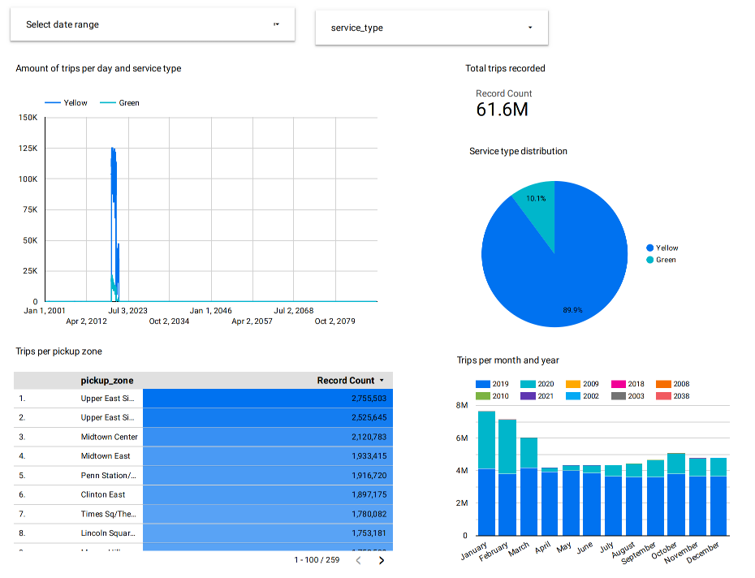

# NYC taxi data analysis

A data pipeline with dbt, Docker, Airflow, Terraform, DuckDB and GCP!

## Description

### Objective

New York City's taxi system is one of the largest urban transportation networks in the world, handling a vast amount of passenger and trip data daily. Analyzing this data can reveal critical insights into the city's transportation patterns, aiding in traffic planning, service optimization, and enhancing the passenger experience. This project aims to build an ETL pipeline to thoroughly analyze and model the NYC Taxi dataset and develop a visualization dashboard to provide valuable insights for decision-makers, researchers, and the public.

### Dataset

We use the [TLC Trip Record Data](https://www.nyc.gov/site/tlc/about/tlc-trip-record-data.page). Yellow and green taxi trip records include fields capturing pick-up and drop-off dates/times, pick-up and drop-off locations, trip distances, itemized fares, rate types, payment types, and driver-reported passenger counts. But I download the dataset from [DataTalksHub](https://github.com/DataTalksClub/nyc-tlc-data). 

We use the following data:

- [Yellow taxi data](https://github.com/DataTalksClub/nyc-tlc-data/releases/tag/yellow)
- [Green taxi data](https://github.com/DataTalksClub/nyc-tlc-data/releases/tag/green)
- [Zone lookup data](https://github.com/DataTalksClub/nyc-tlc-data/releases/download/misc/taxi_zone_lookup.csv)

### Tools & Technologies

- Cloud - [**Google Cloud Platform**](https://cloud.google.com/)

- Infrastructure as Code tool - [**Terraform**](https://www.terraform.io/)
- Containerization - [**Docker**](https://www.docker.com/), [**Docker Compose**](https://docs.docker.com/compose/)

- Orchestration tool - [**Airflow**](https://airflow.apache.org/)

- Transformation - [**dbt**](https://www.getdbt.com/)

- Data Lake - [**Google Cloud Storage**](https://cloud.google.com/storage)

- Data Warehouse - [**BigQuery**](https://cloud.google.com/bigquery)
- Data Visualization - [**Looker Studio**](https://datastudio.google.com/overview)
- Programming Language - [**Python**](https://www.python.org/)
- Other tools - [**DuckDB**](https://duckdb.org/)

### Architecture

TODO

### Final Dashboard

## Setup

### Let's start

- Google cloud platform environment - [Setup](./setup/GCP-Setup.md)
- Create infra on GCP with Terraform - [Setup](./setup/Terraform-Setup.md)
- Airflow orchestration - [Setup](./setup/Airflow-Setup.md)