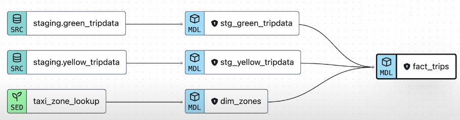

# Airflow Setup

## Setup

1. Navigate to the `airflow` folder.

2. Mount a volume for Google cloud credentials. In the `docker-compose.yml` file, create a volume between the local google cloud credentials file.

   ```yaml
   volumes:
     - ./dags:/opt/airflow/dags
     - ./logs:/opt/airflow/logs
     - ./plugins:/opt/airflow/plugins
     # read-only
     - ~/.google/credentials/:/.google/credentials:ro
     - ./data:/opt/airflow/data
   ```

3. Set environment variables as per your config the `docker-compose.yml` :

   - `GCP_PROJECT_ID`: the id of your Google Cloud project
   - `GCP_GCS_BUCKET`: the id of your Google Cloud Storage bucket
   - `GOOGLE_APPLICATION_CREDENTIALS`: the credentials file path in Docker

4. Build the image and run airflow:

   ```bash
   # build the custom airflow docker image
   docker-compose build
   # initialize the airflow configs
   docker-compose airflow-init
   # Run airflow
   docker-compose up -d
   ```

5. Airflow GUI should be available on port `8080`. Browse to `localhost:8080`. Login with default username & password as **airflow**.

6. Airflow will be running in detached mode. To see the logs from docker, run the following command;

   ```bash
   docker-compose --follow
   ```

7. To stop airflow

   ```bash
   docker-compose down
   ```

## DAGs

- data_ingestion dag


## dbt

The transformations happen using dbt which is triggered by Airflow. The dbt lineage should look something like this:



Dimension:

- dim_zones

Fact:

- fact_trips

Data mart:

- dm_monthly_zone_revenue

We create dashboard based on `fact_trips` table.

